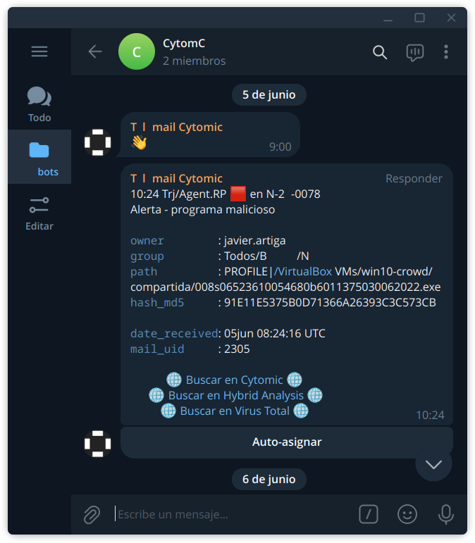

# Tlmail

Bot de Telegram para notificación en modo guardia de ofensas abiertas en QRadar, recibidas por API.

## Instalar y configurar

1. Preparar entorno virtual:
```
python -m pip install pipenv
```

2. Instalar dependencias:
```
python -m pipenv install
```

3. Hacer una copia de [config_tlmail.template.ini](config_tlmail.template.ini) y sustituir en ella
cada parámetro por su valor correspondiente, siguiendo las instrucciones de los comentarios.
Al menos deben configurarse los siguientes parámetros:
de la sección `[QRadar]`, BASE_URL, TOKEN y VERSION;
y de la sección `[Telegram API Token]`, TOKEN y CHAT_ID.
```
cp config_tlmail.template.ini config_tlmail.ini
```

## Ejecutar `tlmail` en pruebas (antes de configurarlo como servicio)

1. Entrar en el entorno virtual:
```
python -m pipenv shell
```

2. Ejecutar el módulo `tlmail`:
```
python -m tlmail
```

## Instalar `tlmail` como servicio, con systemctl

Ejecutar los siguientes pasos como usuario root:

1. En la ruta `/etc/systemd/system/tlmail_customershortname.service` (reemplazar "customershortname" por el nombre correspondiente
tanto aquí como en el parámetro SYSTEMCTL_SERVICE_NAME de [config_tlmail.ini](config_tlmail.template.ini#L6)),
definir el servicio "tlmail_customershortname" con un fichero como este:
```
[Unit]
Description=Telegram bot for on-call notification of open tickets in QRadar, received via the QRadar API

[Service]
User=root
WorkingDirectory=/root/tlmail_customershortname/
ExecStart=/usr/bin/python -m pipenv run python -m tlmail
Restart=always
RuntimeMaxSec=1h

[Install]
WantedBy=multi-user.target
```

2. Recargar las definiciones de servicos:
```
systemctl daemon-reload
```

3. Iniciar el servicio:
```
systemctl start tlmail_customershortname
```

4. Habilitar el servicio (para que arranque automáticamente tras un reinicio de la máquina):
```
systemctl enable tlmail_customershortname
```

Se puede consultar el estado del servicio con `systemctl status tlmail_customershortname` (también se le puede pedir al bot por Telegram, enviándole "/status" en un mensaje)
y ver los últimos logs con `journalctl -u tlmail_customershortname --since yesterday`.

## Interfaz en Telegram

El bot envía mensajes al chat de Telegram con CHAT_ID configurado en [config_tlmail.ini](config_tlmail.template.ini#L26) (normalmente, un chat de grupo).



En cada mensaje hay un botón para la siguiente acción:
- **Auto-asignar**, para que el evento quede asociado al miembro del chat de Telegram que pulse el botón. Esto tiene como consecuencia que, si está en modo `ON_CALL=True`, el evento dejará de reenviarse.

## Ejecutar tests

1. Instalar dependencias de desarrollo:
```
python -m pipenv install --dev
```

2. Ejecutar tests dentro del entorno virtual:
```
python -m pipenv run python -m pytest -rA
```
```
==================================================================================== test session starts ====================================================================================
platform linux -- Python 3.9.2, pytest-6.2.5, py-1.10.0, pluggy-0.13.0
rootdir: /home/javi/g/tlmail, configfile: pytest.ini
plugins: cov-3.0.0, anyio-3.6.1
collected 2 items

tests/test_format_time.py .                                                                                                                                                           [ 50%]
tests/test_msg_meets_filtering_conditions.py .                                                                                                                                        [100%]

========================================================================================== PASSES ===========================================================================================
================================================================================== short test summary info ==================================================================================
PASSED tests/test_format_time.py::test_format_time
PASSED tests/test_msg_meets_filtering_conditions.py::test_msg_meets_filtering_conditions
===================================================================================== 2 passed in 0.24s =====================================================================================
```
